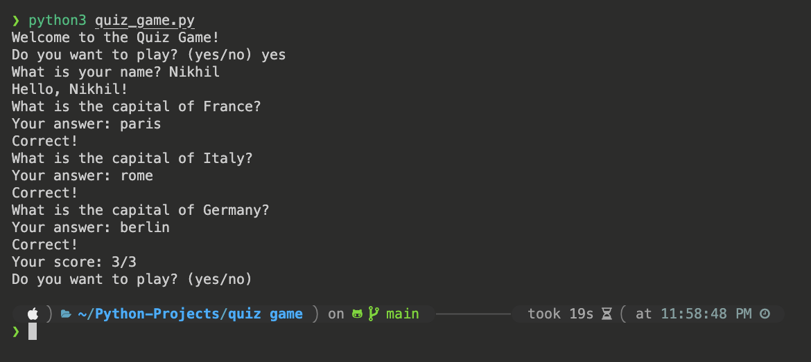
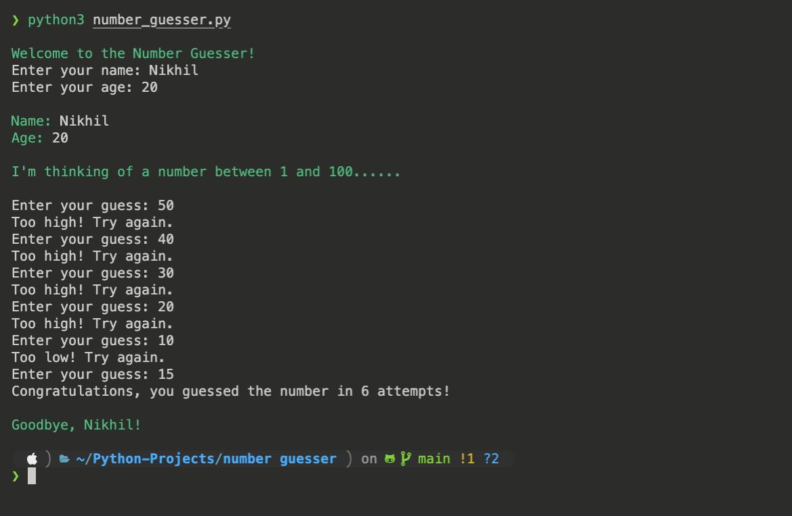

# Python-Projects

This repository contains all the python projects.

## Quiz Game

The Quiz Game is a command line application that asks the user a series of questions and keeps track of the score.

### How to Play

1. Clone the repository
2. Navigate to the quiz game directory
3. Run the application with `python quiz_game.py`
4. Answer the questions
5. The application will keep track of the score and let you know how you did at the end

### Features

- The application will ask the user a series of questions
- The application will keep track of the score
- The application will let the user know how they did at the end

### Screenshots

## Rock Paper Scissor

The Rock Paper Scissor is a command line application that allows the user to play the game against the computer.

### How to Play

1. Clone the repository
2. Navigate to the rock paper scissor directory
3. Run the application with `python rock_paper_scissor.py`
4. Play the game
5. The application will keep track of the score and let you know how you did at the end

### Features

- The application will allow the user to play the game against the computer
- The application will keep track of the score
- The application will let the user know how they did at the end

### Screenshots

## Number Guesser

The Number Guesser is a command line application that allows the user to guess a number between 1 and 100.

### How to Play

1. Clone the repository
2. Navigate to the number guesser directory
3. Run the application with `python number_guesser.py`
4. Guess the number
5. The application will keep track of the score and let you know how you did at the end

### Features

- The application will allow the user to guess a number between 1 and 100
- The application will keep track of the score
- The application will let the user know how they did at the end

### Screenshots

